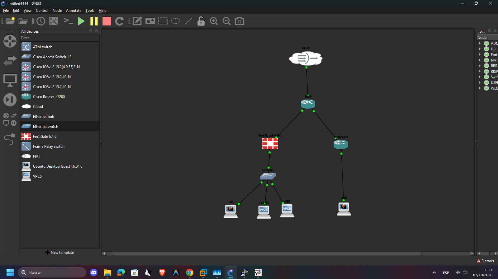

**VIDEO DEMOSTRACIÓN:** https://youtu.be/CzorAFQLSbI

---

# Práctica P1 – Diseño e implementación de topología de red

**Estudiante:** Diomedes Mateo Alvarez
**Matrícula:** 20250873

## Descripción

Laboratorio de red simulado en **GNS3** que integra un proveedor de servicio (ISP),
un firewall **FortiGate 6.4.6** y las redes
internas de las áreas ADMIN, USER, DB y WEB.

## Topología



| Nodo | Dispositivo | Función |
|------|-------------|---------|
| NAT1 | Cloud (NAT) | Salida a Internet |
| ISP | Router Cisco IOSvL2 | Enrutamiento del proveedor de servicio |
| FortiGate-6.4.6-1 | FortiGate 6.4.6 | Firewall / segmentación de áreas |
| Switch1 | Ethernet switch | Conexión de las áreas internas |
| DB, ADMIN, USER | VPCS | Servidor de base de datos, administración y usuarios |
| WEB | VPCS | Servidor web de la sucursal |

## Estructura del repositorio

```
.
├── README.md                                  ← link del video (primero)
├── DiomedesMateoAlvarez_20250873_P1.txt       ← archivo entregable
├── docs/
│   ├── topologia.png                          ← diagrama de la topología
│   └── informe.md                             ← informe / memoria descriptiva
├── configs/
│   ├── ISP/isp.cfg                            ← configuración del router ISP
│   ├── FortiGate/fortigate.conf               ← configuración del firewall
│   ├── Switch1/switch1.cfg                    ← configuración del switch

```

## Requisitos demostrados en el video

1. Fecha y hora del sistema.
2. Rostro y voz del estudiante.
3. Topología desplegada en GNS3.
4. Configuración de dispositivos y verificación de conectividad.

## Uso

1. Abrir el proyecto en GNS3.
2. Levantar todos los nodos.
3. Aplicar las configuraciones de `configs/` y `hosts/`.
4. Ejecutar `scripts/verificar_conectividad.bat` o los `ping` desde VPCS.
